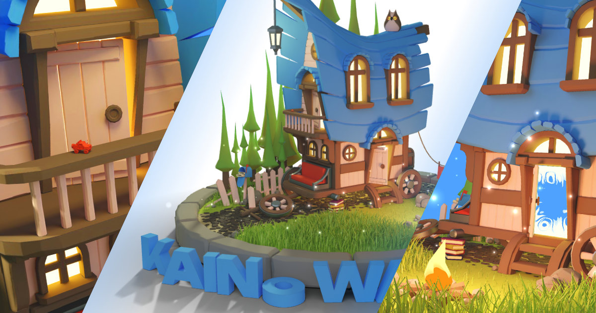

# Kaino Wagon. My first three.js website
You can see it here:
https://kaino-wagon.vercel.app/

---

## Upgrade. Version 2.0
2024-01

- Added a [donation](https://boosty.to/buninman/donate) button so that all those who care could contribute to the production of new interesting websites and games.
- Added a link to [Discord](https://discord.gg/3W2GkhA32p), as I now have a server where I invite people to chat and stay connected.
- Added music.
- Fixed a bug where multiple hints could be selected at once.
- Now, when hovering over a hint, the camera stops rotating.
- Improved the loader button, it now stops rotating when active.
- Added a custom cursor that I drew manually!

## Version 1.0
2023-06

The website was created for learning purposes. I tried to use everything I learned. The website may be quite meaningless, but it looks good, doesn't it?
- The loader and 3D model were created in Blender 
- All animation was created using JS and GLSL
- All textures are created by baking. There is no light in the scene

It was a long journey in learning JS, Three.js, and Blender. I am very grateful to Bruno Simon for creating such an inspiring portfolio with the red car. I am glad to learn from the best. I bought his course and am happy to learn from the best.

---

### Setup
⚠ Download [Node.js](https://nodejs.org/en/download/).
Run this followed commands:

``` bash
# Just be sure that you've got parcel js on you system
npm install

# Serve at localhost:1234
npm run dev

# Build for production in the dist/ directory
npm run build
```
